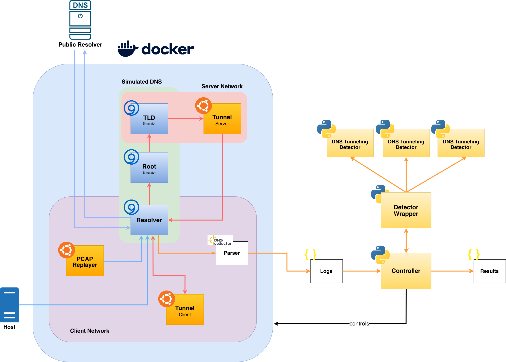

# TunFrame

TunFrame is a benchmarking framework for evaluating DNS tunneling detection methods against adversarial evasion techniques. It provides a standardized, reproducible environment to measure detection effectiveness under comparable conditions.

> Developed as part of the bachelor's thesis *"Evaluating adversarial evasion of DNS Tunneling Detection"*.

---

## Table of Contents

- [Prerequisites](#prerequisites)
- [Setup](#setup)
- [Project Structure](#project-structure)
- [How It Works](#how-it-works)
- [Adding a Detection Method](#adding-a-detection-method)
- [Adding a Tunneling Tool](#adding-a-tunneling-tool)
- [Configuring the Framework](#configuring-the-framework)
- [Running the Framework](#running-the-framework)
- [Output](#output)

---

## Prerequisites

Ensure the following are installed before using TunFrame:

- **Python** ≥ 3.9
- **Docker** and **Docker Compose**
---

## Setup

### 1. Create virtual environment

```bash
python3 -m venv .venv
source .venv/bin/activate
```

### 2. Install dependencies

```bash
pip install -r requirements.txt
```

### 3. Configure the framework

Edit `config.yaml` to specify your test run parameters. See [Configuring the Framework](#configuring-the-framework) for details.

---

## Project Structure

```
TunFrame/
├── main.py                        # Entry point
├── config.yaml                    # Main configuration file
├── requirements.txt
├── docker-compose.yaml            # Docker setup for tunneling tools
├── detection/
│   ├── detector_base/
│   │   └── detector_base.py       # Abstract base class for detectors
│   └── detectors/                 # One subdirectory per detection method
├── pcaps/                         # PCAP files for replay mode
├── allowlists/
│   ├── tranco.txt                 # Global allowlist (e.g., Tranco top domains)
│   └── local/                     # Per-detector allowlists
├── results/                       # Output logs and benchmark results
└── documentation/
    └── docker_architecture.png
```

---

## How It Works



TunFrame orchestrates three traffic sources simultaneously on an isolated Docker network:

1. **Benign traffic** – replayed from a PCAP to simulate normal DNS activity
2. **Wildcard traffic** – replayed PCAP to stress-test allowlist coverage
3. **Tunnel traffic** – either replayed from PCAP or generated live via a Dockerized tunneling tool

Each configured detector monitors DNS traffic in real time. A `peacetime` phase (optional) runs before tunneling starts, allowing detectors to build a baseline. Results are written to the configured `output.logdir`.

**Replay vs. Docker mode** (mutually exclusive):

| Mode | Config | Description |
|---|---|---|
| Replay | `tunnel.replay: true` | Injects pre-recorded tunneling traffic via tcpreplay |
| Docker (live) | `tunnel.docker: true` | Spins up client/server containers to generate live tunneling traffic |

---

## Adding a Detection Method

1. Create a new directory under `detection/detectors/` named after your method.
2. Implement your detector in a Python file within that directory, following the interface defined in `detection/detector_base/detector_base.py`.

---

## Adding a Tunneling Tool

1. Containerize the tunneling tool using Docker — create separate images for client and server.
2. Add both containers to `docker-compose.yaml`, connecting them to the appropriate networks:
   - Client → `client-network`
   - Server → `server-network`
3. In `config.yaml`, set:
   - `traffic.tunnel.tunneling_domains` – domain(s) the tool uses
   - `traffic.tunnel.tunnel_server_ip` – IP of the tunnel server (must be in `192.168.0.0/16`)
   - `traffic.tunnel.toolname` – name used for logging

---

## Configuring the Framework

All settings are defined in `config.yaml`. Parameters marked **required** must be set; all others have usable defaults.

### Global Settings

| Parameter | Type | Required | Description | Default |
|---|---|---|---|---|
| `global.name` | string | No | Name of the test run | `TunFrame` |
| `global.description` | string | No | Description of the test run | `No description.` |
| `global.public_resolver` | IP | **Yes** | IP of the public DNS resolver for non-tunneled queries | `1.1.1.1` |

### Timing Settings

| Parameter | Type | Required | Description | Default |
|---|---|---|---|---|
| `timing.duration` | int | **Yes** | Total test run duration in seconds | `100` |
| `timing.peacetime_duration` | int | No | Duration of pre-tunnel baseline phase in seconds (no tunneling occurs) | `0` |

### Allowlist Settings

| Parameter | Type | Required | Description | Default |
|---|---|---|---|---|
| `allowlist.global_allowlist_path` | path | **Yes** | Path to global allowlist (e.g., Tranco top-1M domains) — prevents false positives on legitimate domains | `./allowlists/tranco.txt` |
| `allowlist.local_allowlist_dir` | path | No | Directory with per-detector allowlist files | `./allowlists/local` |

### Traffic Settings

#### General

| Parameter | Type | Required | Description | Default |
|---|---|---|---|---|
| `traffic.pcap_path` | path | **Yes** | Directory containing all PCAP files | `./pcaps` |

#### Benign Traffic

| Parameter | Type | Required | Description | Default |
|---|---|---|---|---|
| `traffic.benign.enabled` | bool | No | Inject benign DNS traffic alongside tunneling | `false` |
| `traffic.benign.pcap` | string | If enabled | Filename of benign traffic PCAP | `benign.pcap` |
| `traffic.benign.pps` | int | No | Replay rate in packets per second | `10000` |

#### Wildcard Traffic

| Parameter | Type | Required | Description | Default |
|---|---|---|---|---|
| `traffic.wildcard.enabled` | bool | No | Inject wildcard DNS traffic | `false` |
| `traffic.wildcard.pcap` | string | If enabled | Filename of wildcard DNS PCAP | `wildcard.pcap` |
| `traffic.wildcard.pps` | int | No | Replay rate in packets per second | `1000` |

#### Tunnel Traffic

| Parameter | Type | Required | Description | Default |
|---|---|---|---|---|
| `traffic.tunnel.replay` | bool | **Yes\*** | Replay tunnel traffic from PCAP | `false` |
| `traffic.tunnel.docker` | bool | **Yes\*** | Generate live tunnel traffic via Docker containers | `false` |
| `traffic.tunnel.pcap` | string | If replay | Filename of tunnel traffic PCAP | `tunnel.pcap` |
| `traffic.tunnel.pps` | int | No | Replay rate in packets per second | `10` |
| `traffic.tunnel.toolname` | string | No | Name of tunneling tool (used for labeling in results) | `Tunnel` |
| `traffic.tunnel.tunneling_domains` | list[string] | **Yes** | Domain(s) used by the tunneling tool | `["tunnel.com"]` |
| `traffic.tunnel.tunnel_server_ip` | IP | If docker | IP of tunnel server — must be within `192.168.0.0/16` (Docker internal network) | `192.168.3.3` |
| `traffic.tunnel.expansion_factor` | int | No | Multiplier for tunneled payload size (e.g., `3` means 1 byte of data generates ~3 bytes of DNS traffic) | `1` |


### Output Settings

| Parameter | Type | Required | Description | Default |
|---|---|---|---|---|
| `output.logdir` | path | **Yes** | Directory for storing benchmark results and logs | `results` |

---

## Example Configurations

### Minimal — Replay Mode

```yaml
global:
  public_resolver: "1.1.1.1"

timing:
  duration: 120

allowlist:
  global_allowlist_path: "./allowlists/tranco.txt"

traffic:
  pcap_path: "./pcaps"
  tunnel:
    replay: true
    docker: false
    pcap: "tunnel.pcap"
    tunneling_domains: ["tunnel.example.com"]

output:
  logdir: "results"
```

### Full — Live Docker Mode with Benign Traffic

```yaml
global:
  name: "dnscat2-evasion-test"
  description: "Live dnscat2 tunneling with benign background traffic"
  public_resolver: "1.1.1.1"

timing:
  duration: 300
  peacetime_duration: 30

allowlist:
  global_allowlist_path: "./allowlists/tranco.txt"
  local_allowlist_dir: "./allowlists/local/"

traffic:
  pcap_path: "./pcaps"
  benign:
    enabled: true
    pcap: "benign.pcap"
    pps: 500
  wildcard:
    enabled: false
  tunnel:
    replay: false
    docker: true
    toolname: "dnscat2"
    tunneling_domains: ["tunnel.example.com"]
    tunnel_server_ip: "192.168.3.3"
    expansion_factor: 1

output:
  logdir: "results"
```

---

## Running the Framework

```bash
(.venv) python3 main.py
```

---

## Output

Results are written to the directory specified in `output.logdir`. Each run produces:

- Per-detector logs with flagged DNS queries
- Aggregate benchmark metrics (precision, recall, F1) per detector
- A run summary with configuration snapshot and timestamps
