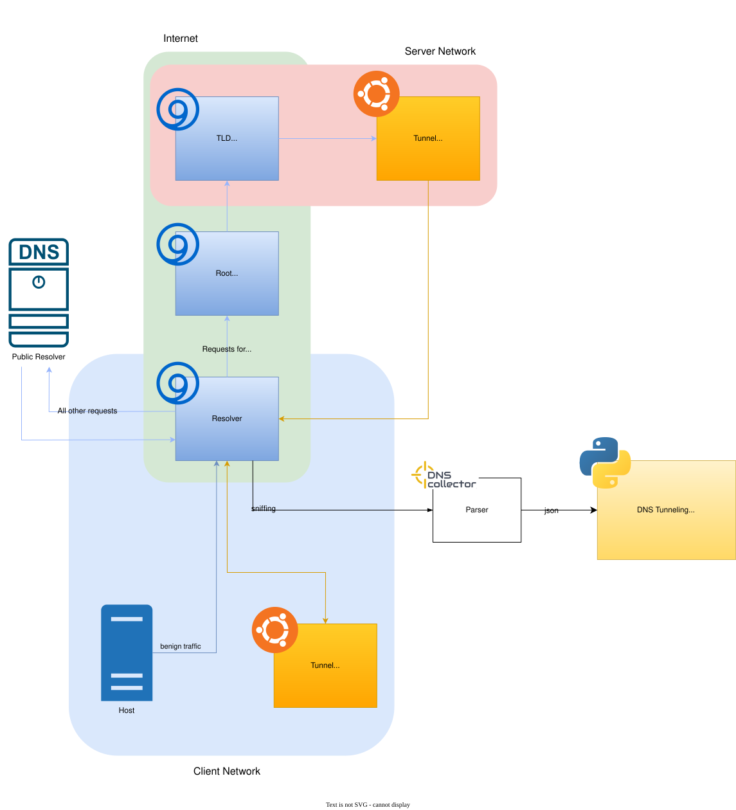

# Framework for benchmarking DNS tunneling detection methods against modern evasion techniques under comparable conditions

This repository contains the code and documentation for TunFrame, a framework designed to benchmark DNS tunneling detection methods against modern evasion techniques. The goal of TunFrame is to provide a standardized environment for evaluating the effectiveness of various detection methods under comparable conditions.

## Setup

### 1. Create virtual environment

```bash
python3 -m venv .venv
source .venv/bin/activate
```

### 2. Install dependencies

```bash
pip install -r requirements.txt
```

## Adding a Detection Method

To add a new DNS tunneling detection method to TunFrame, follow these steps:

1. Create a new directory under `detection/detectors` with the name of your method.
2. Implement the detection logic in a Python file within that directory. It should follow the interface defined in `detection/detector_base/detector_base.py`.

## Configuring the Framework

The framework can be configured using the `config.yaml` file.

| Parameter | Type | Description | Default |
|-----------|------|-------------|---------|
| `global.name` | string | Name of test run | `TunFrame` |
| `global.description` | string | Description of test run | `No description.` |
| `global.public_resolver` | IP | IP address of public resolver used for resolving non-tunneling DNS requests | `1.1.1.1` |
| `traffic.pcap_path` | path | Directory containing PCAP files | `./pcaps` |
| `traffic.benign.enabled` | bool | Enable benign DNS traffic injection | `false` |
| `traffic.benign.pcap` | string | Filename of benign traffic PCAP | `benign.pcap` |
| `traffic.benign.pps` | int | Packets per second for benign traffic replay | `10000` |
| `traffic.wildcard.enabled` | bool | Enable wildcard DNS traffic injection | `false` |
| `traffic.wildcard.pcap` | string | Filename of wildcard DNS PCAP | `wildcard.pcap` |
| `traffic.wildcard.pps` | int | Packets per second for wildcard traffic replay | `1000` |
| `traffic.tunnel.replay` | bool | Enable replay mode | `false` |
| `traffic.tunnel.pcap` | string | Filename of DNS tunneling traffic PCAP | `tunnel.pcap` |
| `traffic.tunnel.pps` | int | Packets per second for tunnel traffic replay | `10` |
| `traffic.tunnel.toolname` | string | Name of DNS tunneling tool used (e.g., `dnscat2`, `iodine`) | `Tunnel` |
| `traffic.tunnel.tunneling_domains` | list[string] | List of domains used by the tunneling tool | `["tunnel.com"]` |
| `traffic.tunnel.tunnel_server_ip` | IP | IP address of the DNS tunnel server ( needs to be in `192.168.0.0/16`) | `192.168.3.3` |
| `timing.duration` | int | Duration of test run in seconds | `100` |
| `output.logdir` | path | Directory for storing benchmark results and logs | `results` |

## Running the Framework

To run the TunFrame framework, execute the following command:

```bash
(.venv) python3 main.py
```

## Adding Tunneling Tools

To run a DNS tunneling tool in TunFrame, follow these steps:

1. Containerize your tunneling tool using Docker, creating a seperate container for client and server.
2. Specify the server domain and ip address in the config.yaml file.
3. Run the main.py script.
4. Deploy the containers specifying the network which is "client-network" for the client and "server-network" for the server.


